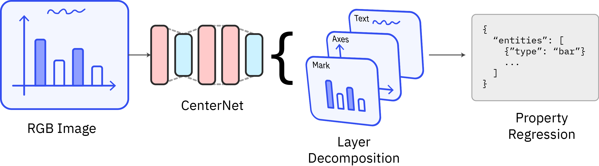

# DeVIZ: Data Visualization Decompiler


[[Video]](https://www.youtube.com/watch?v=JmG8-sZFIbM) [[Website]](https://inverse.firemeet.io/) [[Paper]](FinalPaper.pdf)


#### Abstract

Creating static visualizations is a lossy process, a user's code and data is compiled in the form of a static image. These images are the default form of data visualizations, and are ubiquitous across both social media and academia. As visualization researchers, this lossy compilation into images makes it very challenging to experiment and tweak with design decisions of the original author. In this work, we present a novel deep-learning based algorithm that can _decompile_ an image visualization, allowing researchers to easily edit and inspect its visual design. Our method and domain-specific language is more general than previous approaches and is extensible to more types of data visualizations without the need for expert-tuned heuristics.

## Developmental Setup

### Pretrained Models

Pretrained models should be unzipped into `backend/marks`, structure should be something like,

```
backend/marks/
  box_model2/
    saved_model.pb
    assets/
    variables/
```

|Name|Link|
|----|-------------|
|`box_model`|[Download](https://www.dropbox.com/s/33xi78jockuvrsi/box_model.zip?dl=1)|
|`box_model2`|[Download](https://www.dropbox.com/s/aum7nifjmzhwlny/box_model2.zip?dl=1)|

### Running

Install Python Deps,

```
pip install -r requirements.txt
```

Unpack pretrained models as described in the next subsection.

Run dev server,

```
python serve.py
```

Inside `frontend/`, install deps,

```
npm install
```

And while the backend is running, finally,

```
npm run serve
```

Chrome extention launcher can be loaded as an unpacked web extention.

## Research Commentary

